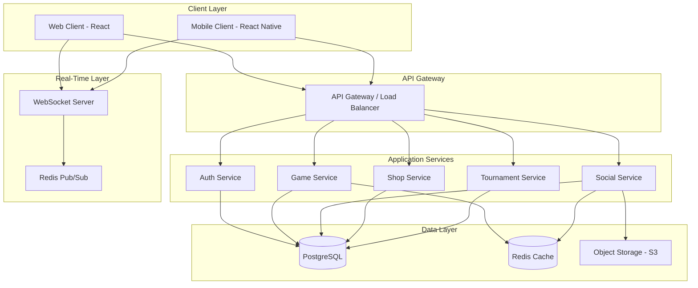

# Design Document: Rummy Game Platform

## Overview

The Rummy Game Platform is a modern, real-time multiplayer gaming system that provides three game variants (Rummy PRO, Rummy 45, and Canasta) with social features, tournaments, and e-commerce capabilities. The platform will be built as a responsive web application with mobile support, featuring a clean, modern UI with smooth animations and real-time gameplay.

The architecture follows a client-server model with WebSocket connections for real-time game state synchronization, RESTful APIs for account management and transactions, and a microservices approach for scalability.

## Architecture

### High-Level Architecture



### Technology Stack

**Frontend:**

- React 18+ for web client
- React Native for mobile apps
- TypeScript for type safety
- Redux Toolkit for state management
- Socket.io-client for WebSocket connections
- Framer Motion for animations
- TailwindCSS for styling

**Backend:**

- Node.js with Express for REST APIs
- Socket.io for WebSocket server
- TypeScript for type safety
- PostgreSQL for relational data
- Redis for caching and pub/sub
- AWS S3 or similar for file storage

**Infrastructure:**

- Docker for containerization
- Kubernetes for orchestration (optional)
- Nginx as reverse proxy
- JWT for authentication

## Components and Interfaces

### 1. Authentication Service

**Responsibilities:**

- User registration and login
- Password encryption and validation
- JWT token generation and validation
- Multi-account detection
- Session management

**Key Interfaces:**

```typescript
interface AuthService {
  register(userData: RegistrationData): Promise<UserAccount>;
  login(credentials: LoginCredentials): Promise<AuthToken>;
  validateToken(token: string): Promise<TokenValidation>;
  detectCloneAccount(deviceInfo: DeviceFingerprint): Promise<boolean>;
  resetPassword(email: string): Promise<void>;
}

interface RegistrationData {
  username: string;
  email: string;
  password: string;
  deviceFingerprint: DeviceFingerprint;
}

interface DeviceFingerprint {
  ipAddress: string;
  userAgent: string;
  deviceId: string;
  browserFingerprint: string;
}
```

### 2. Game Engine Service

**Responsibilities:**

- Game state management
- Tile distribution and shuffling
- Move validation
- Combination verification
- Scoring calculation
- Win condition checking

**Key Interfaces:**

```typescript
interface GameEngine {
  initializeGame(config: GameConfig): GameState;
  validateMove(gameState: GameState, move: PlayerMove): ValidationResult;
  applyMove(gameState: GameState, move: PlayerMove): GameState;
  checkWinCondition(gameState: GameState, playerId: string): WinResult;
  calculateScore(winResult: WinResult): ScoreResult;
}

interface GameState {
  gameId: string;
  gameType: 'RUMMY_PRO' | 'RUMMY_45' | 'CANASTA';
  players: Player[];
  currentTurn: string; // playerId
  tiles: Tile[];
  stock: Tile[];
  discardPile: Tile[];
  table: Combination[];
  status: 'WAITING' | 'IN_PROGRESS' | 'COMPLETED';
}

interface Tile {
  id: string;
  number: number; // 1-13
  color: 'RED' | 'YELLOW' | 'BLUE' | 'BLACK';
  isJoker: boolean;
}

interface Combination {
  type: 'RUN' | 'SET';
  tiles: Tile[];
  isValid: boolean;
}

interface PlayerMove {
  type: 'DRAW' | 'DISCARD' | 'MELD' | 'REPLACE_JOKER' | 'CLOSE';
  playerId: string;
  tile?: Tile;
  combination?: Combination;
}
```

### 3. Social Service

**Responsibilities:**

- Friend management
- Player profiles
- Avatar upload and storage
- Player search
- Online status tracking

**Key Interfaces:**

```typescript
interface SocialService {
  sendFriendRequest(fromUserId: string, toUserId: string): Promise<FriendRequest>;
  acceptFriendRequest(requestId: string): Promise<Friendship>;
  getFriendsList(userId: string): Promise<Friend[]>;
  updateProfile(userId: string, updates: ProfileUpdate): Promise<PlayerProfile>;
  uploadAvatar(userId: string, image: File): Promise<string>;
  searchPlayers(query: string): Promise<PlayerProfile[]>;
}

interface PlayerProfile {
  userId: string;
  username: string;
  avatarUrl: string;
  level: number;
  totalGames: number;
  wins: number;
  ranking: number;
  isOnline: boolean;
}
```

### 4. Chat Service

**Responsibilities:**

- Real-time message delivery
- Message filtering and moderation
- Chat history storage
- Offensive language detection

**Key Interfaces:**

```typescript
interface ChatService {
  sendMessage(message: ChatMessage): Promise<void>;
  filterMessage(content: string): FilterResult;
  getChatHistory(tableId: string, limit: number): Promise<ChatMessage[]>;
  reportMessage(messageId: string, reason: string): Promise<void>;
}

interface ChatMessage {
  messageId: string;
  tableId: string;
  senderId: string;
  senderName: string;
  content: string;
  timestamp: Date;
  isFiltered: boolean;
}

interface FilterResult {
  isAllowed: boolean;
  filteredContent: string;
  violations: string[];
}
```

### 5. Tournament Service

**Responsibilities:**

- Tournament scheduling
- Player registration
- Bracket management
- Prize distribution

**Key Interfaces:**

```typescript
interface TournamentService {
  createTournament(config: TournamentConfig): Promise<Tournament>;
  registerPlayer(tournamentId: string, playerId: string): Promise<void>;
  startTournament(tournamentId: string): Promise<void>;
  updateStandings(tournamentId: string, results: MatchResult[]): Promise<void>;
  distributePrizes(tournamentId: string): Promise<void>;
}

interface Tournament {
  tournamentId: string;
  name: string;
  startTime: Date;
  gameType: 'RUMMY_PRO' | 'RUMMY_45' | 'CANASTA';
  maxPlayers: number;
  entryFee: number;
  prizePool: Prize[];
  status: 'SCHEDULED' | 'REGISTRATION' | 'IN_PROGRESS' | 'COMPLETED';
}
```

### 6. Shop Service

**Responsibilities:**

- Product catalog management
- Purchase processing
- Inventory management
- Transaction recording

**Key Interfaces:**

```typescript
interface ShopService {
  getProducts(): Promise<Product[]>;
  purchaseProduct(userId: string, productId: string, payment: PaymentInfo): Promise<Transaction>;
  getInventory(userId: string): Promise<InventoryItem[]>;
  validatePurchase(userId: string, productId: string): Promise<boolean>;
}

interface Product {
  productId: string;
  name: string;
  description: string;
  price: number;
  type: 'EXTRA_JOKER' | 'PREMIUM_FEATURE' | 'COSMETIC';
  isTransferable: false; // Always false per requirements
}

interface Transaction {
  transactionId: string;
  userId: string;
  productId: string;
  amount: number;
  timestamp: Date;
  isRefundable: false; // Always false per requirements
}
```

## Data Models

### User Account

```typescript
interface UserAccount {
  userId: string;
  username: string;
  email: string;
  passwordHash: string;
  createdAt: Date;
  lastLogin: Date;
  isSuspended: boolean;
  suspensionReason?: string;
  deviceFingerprints: DeviceFingerprint[];
}
```

### Player Statistics

```typescript
interface PlayerStats {
  userId: string;
  totalGames: number;
  wins: number;
  losses: number;
  totalPoints: number;
  ranking: number;
  level: number;
  experience: number;
  achievements: Achievement[];
}
```

### Game Record

```typescript
interface GameRecord {
  gameId: string;
  gameType: 'RUMMY_PRO' | 'RUMMY_45' | 'CANASTA';
  players: PlayerGameData[];
  winner: string; // userId
  winPattern?: WinPattern;
  startTime: Date;
  endTime: Date;
  finalScores: Map<string, number>;
}

interface PlayerGameData {
  userId: string;
  finalHand: Tile[];
  combinations: Combination[];
  score: number;
  disconnections: number;
}

type WinPattern =
  | 'CLEAN'
  | 'FREE_JOKER'
  | 'MONOCHROME'
  | 'BICOLOR'
  | 'MINOR'
  | 'MAJOR'
  | 'GRAND_SQUARE'
  | 'MOZAIC'
  | 'DOUBLES';
```

### Friendship

```typescript
interface Friendship {
  friendshipId: string;
  user1Id: string;
  user2Id: string;
  createdAt: Date;
  status: 'ACTIVE';
}

interface FriendRequest {
  requestId: string;
  fromUserId: string;
  toUserId: string;
  createdAt: Date;
  status: 'PENDING' | 'ACCEPTED' | 'REJECTED';
}
```

## Correctness Properties

_A property is a characteristic or behavior that should hold true across all valid executions of a system—essentially, a formal statement about what the system should do. Properties serve as the bridge between human-readable specifications and machine-verifiable correctness guarantees._

### Property Reflection

After analyzing all acceptance criteria, I've identified several areas where properties can be consolidated to eliminate redundancy:

**Tile Conservation Properties:** Properties 6.2 and 6.3 (draw/discard tile movement) can be combined into a single comprehensive property about tile conservation during all game actions.

**Scoring Properties:** Properties 7.3, 7.4, and 7.5 (different win types) can be consolidated into a single property that verifies correct scoring based on win pattern.

**Pattern Detection Properties:** Properties 8.1-8.5 (various win patterns) can be combined into a single property that verifies pattern detection and bonus calculation.

**Animation Properties:** Properties 15.2-15.5 (various animations) can be combined into a single property that verifies animations are triggered for their respective events.

**Audio Properties:** Properties 19.1-19.3 (various sounds) can be combined into a single property that verifies sounds are triggered for their respective events.

**Responsive UI Properties:** Properties 17.1, 17.2, and 17.4 (different device interfaces) can be combined into a single property about responsive rendering.

### Core Correctness Properties

**Property 1: Account Creation Uniqueness**
_For any_ valid registration data, creating an account should result in a unique user ID and encrypted password that differs from the plaintext password.
**Validates: Requirements 1.1**

**Property 2: Authentication Round-Trip**
_For any_ valid user account, logging in with correct credentials should grant access, and the authenticated session should contain the correct user information.
**Validates: Requirements 1.2**

**Property 3: Clone Account Detection**
_For any_ device fingerprint that has already been used for registration, attempting to create another account with the same or similar fingerprint should be detected and prevented.
**Validates: Requirements 1.3**

**Property 4: Password Update Security**
_For any_ user account and new password, updating the password should require current password verification, and the new password should be encrypted differently than the old password.
**Validates: Requirements 1.4**

**Property 5: Friend Relationship Symmetry**
_For any_ two users where user A accepts a friend request from user B, both users should appear in each other's friend lists (bidirectional relationship).
**Validates: Requirements 2.3**

**Property 6: Search Result Completeness**
_For any_ player database and search query, all players whose username or profile information matches the query should appear in the search results.
**Validates: Requirements 2.5**

**Property 7: Chat Message Broadcast**
_For any_ game table with N players, when one player sends a message, all N players (including the sender) should receive the message within 500 milliseconds.
**Validates: Requirements 3.2**

**Property 8: Offensive Content Filtering**
_For any_ message containing words from the offensive language list, the message should be filtered or blocked before being broadcast to other players.
**Validates: Requirements 3.3, 3.4**

**Property 9: Game Initialization Tile Count**
_For any_ Rummy PRO game initialization, the total tile count should be exactly 106 (or up to 110 with extra Jokers), with each numbered tile appearing exactly twice.
**Validates: Requirements 4.1, 4.4**

**Property 10: Tile Distribution Correctness**
_For any_ game with N players, after initialization, each player should have exactly 14 tiles (except the starting player who has 15), and the sum of all player tiles plus stock plus discard pile should equal the total tile count.
**Validates: Requirements 4.3**

**Property 11: Run Validation**
_For any_ tile combination claimed to be a Run, it should be valid if and only if it contains 3+ tiles of the same color with consecutive numbers (allowing Jokers as wildcards).
**Validates: Requirements 5.1**

**Property 12: Set Validation**
_For any_ tile combination claimed to be a Set, it should be valid if and only if it contains 3-4 tiles with the same number in different colors (allowing Jokers as wildcards).
**Validates: Requirements 5.2**

**Property 13: Joker Replacement Correctness**
_For any_ combination containing a Joker, if a player has the exact tile the Joker represents, replacing the Joker should result in a valid combination with the real tile and the Joker returned to the player's hand.
**Validates: Requirements 5.4**

**Property 14: Invalid Combination Rejection**
_For any_ tile combination that violates Run or Set rules, attempting to place it on the table should be rejected, and all tiles should remain in or return to the player's hand.
**Validates: Requirements 5.5**

**Property 15: Tile Conservation During Actions**
_For any_ game state and player action (draw, discard, meld), the total number of tiles in the system (player hands + table + stock + discard) should remain constant.
**Validates: Requirements 6.2, 6.3**

**Property 16: Turn Action Exclusivity**
_For any_ player's turn, exactly one action type (draw OR discard OR meld OR close) should be allowed before the turn passes to the next player.
**Validates: Requirements 6.1**

**Property 17: Win Condition Validation**
_For any_ player attempting to close, the close should be allowed if and only if all 14 tiles are arranged in valid combinations with exactly one tile remaining to discard.
**Validates: Requirements 7.1, 7.2**

**Property 18: Win Scoring Correctness**
_For any_ winning game state, the score awarded should match the win pattern: 250 for normal, 350-400 for clean finish, 500 for free Joker, plus any pattern bonuses.
**Validates: Requirements 7.3, 7.4, 7.5**

**Property 19: Pattern Detection and Bonus**
_For any_ winning hand, if it matches a special pattern (Monochrome, Bicolor, Minor, Major, Grand Square, Mozaic), the corresponding bonus points should be added to the base score.
**Validates: Requirements 8.1, 8.2, 8.3, 8.4, 8.5**

**Property 20: Canasta Scoring Hierarchy**
_For any_ Canasta game state, clean canastas should always award more points than dirty canastas with the same number of cards.
**Validates: Requirements 10.2**

**Property 21: Tournament Bracket Fairness**
_For any_ tournament with N registered players, the bracket generation should create a balanced structure where all players have an equal path length to the finals (within 1 round).
**Validates: Requirements 11.3**

**Property 22: Purchase Transaction Atomicity**
_For any_ purchase transaction, either both the inventory update AND payment deduction occur, or neither occurs (no partial transactions).
**Validates: Requirements 12.2**

**Property 23: Item Transfer Prevention**
_For any_ purchased item in a player's inventory, attempting to transfer it to another account should always fail and leave the item in the original owner's inventory.
**Validates: Requirements 12.4**

**Property 24: Disconnection State Preservation**
_For any_ game state when a player disconnects and then reconnects within the time limit, the restored game state should be identical to the state at disconnection (round-trip property).
**Validates: Requirements 14.4, 20.2**

**Property 25: Animation Trigger Correctness**
_For any_ game event (tile pickup, discard, win, Joker replacement), the corresponding animation should be triggered and added to the animation queue.
**Validates: Requirements 15.2, 15.3, 15.4, 15.5**

**Property 26: Drag Detection Performance**
_For any_ tile drag action, the system should detect the drag and provide visual feedback within 50 milliseconds.
**Validates: Requirements 16.1**

**Property 27: Responsive Interface Adaptation**
_For any_ device type (desktop, mobile, tablet), the platform should render the appropriate interface optimized for that device's screen size and input method.
**Validates: Requirements 17.1, 17.2, 17.4**

**Property 28: Cross-Platform Data Synchronization**
_For any_ user account, switching from device A to device B should result in identical account data and game state on both devices.
**Validates: Requirements 17.3**

**Property 29: Audio Trigger Correctness**
_For any_ game event (tile click, Joker play, win), the corresponding sound effect should be triggered unless mute is enabled.
**Validates: Requirements 19.1, 19.2, 19.3**

**Property 30: Mute Toggle Effectiveness**
_For any_ game state, toggling mute to ON should prevent all subsequent sound effects from playing, and toggling to OFF should re-enable them.
**Validates: Requirements 19.4**

**Property 31: Periodic State Persistence**
_For any_ game in progress, the game state should be persisted to storage at intervals of 30 seconds (±5 seconds tolerance).
**Validates: Requirements 20.1**

## Error Handling

### Client-Side Error Handling

**Network Errors:**

- Implement exponential backoff for failed API requests
- Display user-friendly error messages for connection issues
- Queue actions locally when offline and sync when connection restored
- Show connection status indicator in UI

**Validation Errors:**

- Validate user input on client before sending to server
- Display inline validation errors for forms
- Prevent invalid game moves with visual feedback
- Show helpful error messages for invalid combinations

**State Errors:**

- Implement error boundaries in React to catch rendering errors
- Log errors to monitoring service (e.g., Sentry)
- Provide fallback UI when components fail
- Auto-recover from transient state issues

### Server-Side Error Handling

**Authentication Errors:**

- Return appropriate HTTP status codes (401, 403)
- Log failed authentication attempts for security monitoring
- Implement rate limiting to prevent brute force attacks
- Clear error messages without exposing security details

**Game Logic Errors:**

- Validate all moves on server regardless of client validation
- Reject invalid moves with detailed error reasons
- Log suspicious patterns (potential cheating)
- Maintain game state consistency even with invalid requests

**Database Errors:**

- Implement transaction rollback for failed operations
- Use connection pooling with retry logic
- Log database errors for monitoring
- Return generic error messages to clients (don't expose DB details)

**WebSocket Errors:**

- Implement automatic reconnection with exponential backoff
- Buffer messages during disconnection
- Sync state after reconnection
- Handle stale connections with heartbeat mechanism

### Error Recovery Strategies

**Game State Recovery:**

```typescript
interface GameStateRecovery {
  // Validate game state integrity
  validateGameState(state: GameState): ValidationResult;

  // Attempt to repair corrupted state
  repairGameState(state: GameState): GameState | null;

  // Rollback to last known good state
  rollbackToCheckpoint(gameId: string): GameState;

  // Notify players of state recovery
  notifyStateRecovery(gameId: string, players: string[]): void;
}
```

**Transaction Recovery:**

- Use database transactions for all financial operations
- Implement idempotency keys for purchase requests
- Log all transactions for audit trail
- Provide manual reconciliation tools for edge cases

## Testing Strategy

### Unit Testing

**Framework:** Jest for both frontend and backend

**Coverage Goals:**

- Minimum 80% code coverage for business logic
- 100% coverage for critical paths (authentication, payments, game logic)

**Key Areas:**

- Game engine validation functions (runs, sets, win conditions)
- Scoring calculation functions
- Authentication and authorization logic
- Data model validation
- Utility functions

**Example Unit Tests:**

```typescript
describe('Run Validation', () => {
  test('should accept valid 3-tile run', () => {
    const tiles = [
      { number: 4, color: 'RED', isJoker: false },
      { number: 5, color: 'RED', isJoker: false },
      { number: 6, color: 'RED', isJoker: false },
    ];
    expect(validateRun(tiles)).toBe(true);
  });

  test('should reject run with mixed colors', () => {
    const tiles = [
      { number: 4, color: 'RED', isJoker: false },
      { number: 5, color: 'BLUE', isJoker: false },
      { number: 6, color: 'RED', isJoker: false },
    ];
    expect(validateRun(tiles)).toBe(false);
  });

  test('should accept run with Joker', () => {
    const tiles = [
      { number: 4, color: 'RED', isJoker: false },
      { number: 0, color: 'RED', isJoker: true }, // represents 5
      { number: 6, color: 'RED', isJoker: false },
    ];
    expect(validateRun(tiles)).toBe(true);
  });
});
```

### Property-Based Testing

**Framework:** fast-check for JavaScript/TypeScript

**Configuration:**

- Minimum 100 iterations per property test
- Use seed-based generation for reproducibility
- Configure shrinking for minimal failing examples

**Property Test Requirements:**

- Each property test MUST include a comment with format: `// Feature: rummy-game-platform, Property {number}: {property_text}`
- Each property test MUST reference the requirements it validates
- Property tests should use smart generators that constrain to valid input spaces

**Key Property Tests:**

```typescript
import fc from 'fast-check';

// Feature: rummy-game-platform, Property 15: Tile Conservation During Actions
describe('Property: Tile Conservation', () => {
  test('total tiles remain constant after any action', () => {
    fc.assert(
      fc.property(gameStateArbitrary(), playerActionArbitrary(), (gameState, action) => {
        const initialCount = countAllTiles(gameState);
        const newState = applyMove(gameState, action);
        const finalCount = countAllTiles(newState);
        return initialCount === finalCount;
      }),
      { numRuns: 100 }
    );
  });
});

// Feature: rummy-game-platform, Property 11: Run Validation
describe('Property: Run Validation', () => {
  test('valid runs are always accepted', () => {
    fc.assert(
      fc.property(validRunArbitrary(), (run) => {
        return validateRun(run.tiles) === true;
      }),
      { numRuns: 100 }
    );
  });

  test('invalid runs are always rejected', () => {
    fc.assert(
      fc.property(invalidRunArbitrary(), (run) => {
        return validateRun(run.tiles) === false;
      }),
      { numRuns: 100 }
    );
  });
});

// Feature: rummy-game-platform, Property 24: Disconnection State Preservation
describe('Property: Disconnection Round-Trip', () => {
  test('disconnect then reconnect preserves game state', () => {
    fc.assert(
      fc.property(gameStateArbitrary(), (gameState) => {
        const saved = saveGameState(gameState);
        const restored = restoreGameState(saved);
        return deepEqual(gameState, restored);
      }),
      { numRuns: 100 }
    );
  });
});
```

**Smart Generators:**

```typescript
// Generator for valid runs
function validRunArbitrary(): fc.Arbitrary<Combination> {
  return fc.record({
    type: fc.constant('RUN'),
    tiles: fc
      .tuple(
        fc.constantFrom('RED', 'YELLOW', 'BLUE', 'BLACK'),
        fc.integer({ min: 1, max: 11 }), // start number
        fc.integer({ min: 3, max: 6 }) // length
      )
      .map(([color, start, length]) => {
        return Array.from({ length }, (_, i) => ({
          id: `tile-${start + i}`,
          number: start + i,
          color,
          isJoker: false,
        }));
      }),
  });
}

// Generator for game states
function gameStateArbitrary(): fc.Arbitrary<GameState> {
  return fc.record({
    gameId: fc.uuid(),
    gameType: fc.constantFrom('RUMMY_PRO', 'RUMMY_45', 'CANASTA'),
    players: fc.array(playerArbitrary(), { minLength: 2, maxLength: 4 }),
    tiles: tileSetArbitrary(),
    status: fc.constantFrom('IN_PROGRESS'),
  });
}
```

### Integration Testing

**Framework:** Supertest for API testing, Playwright for E2E

**Key Integration Tests:**

- Complete game flow from start to finish
- Tournament registration and bracket generation
- Purchase flow with payment processing
- Friend request and acceptance flow
- Chat message delivery across multiple clients
- Disconnection and reconnection scenarios

### Performance Testing

**Tools:** Artillery for load testing, Lighthouse for frontend performance

**Performance Targets:**

- API response time: < 200ms for 95th percentile
- WebSocket message latency: < 100ms
- Page load time: < 2 seconds
- Time to interactive: < 3 seconds
- Support 10,000 concurrent users
- Support 1,000 concurrent games

### Security Testing

**Key Areas:**

- SQL injection prevention
- XSS prevention
- CSRF protection
- Authentication bypass attempts
- Rate limiting effectiveness
- Clone account detection accuracy

## Security Considerations

### Authentication & Authorization

**Password Security:**

- Use bcrypt with salt rounds ≥ 12 for password hashing
- Enforce minimum password requirements (8+ characters, mixed case, numbers)
- Implement password reset with time-limited tokens
- Lock accounts after 5 failed login attempts

**Session Management:**

- Use JWT with short expiration (15 minutes for access token)
- Implement refresh tokens with longer expiration (7 days)
- Store refresh tokens securely (httpOnly cookies)
- Implement token revocation for logout

**Authorization:**

- Verify user permissions on every API request
- Use role-based access control (RBAC)
- Validate game table access (players can only access their tables)
- Prevent unauthorized access to other players' data

### Data Protection

**Encryption:**

- Use HTTPS/TLS for all communications
- Encrypt sensitive data at rest (passwords, payment info)
- Use environment variables for secrets (never commit to code)

**Input Validation:**

- Validate and sanitize all user inputs
- Use parameterized queries to prevent SQL injection
- Implement rate limiting on all endpoints
- Validate file uploads (type, size, content)

**Privacy:**

- Comply with GDPR/privacy regulations
- Allow users to delete their accounts
- Anonymize data in logs
- Implement data retention policies

### Anti-Cheating Measures

**Detection Systems:**

- Monitor for impossible moves or timing
- Detect patterns of collusion between players
- Track win rates and flag statistical anomalies
- Log all game actions for review

**Prevention:**

- Validate all moves on server (never trust client)
- Use server-authoritative game state
- Implement anti-automation measures (CAPTCHA for suspicious activity)
- Randomize tile distribution with cryptographically secure RNG

## Deployment Architecture

### Infrastructure

**Production Environment:**

```
┌─────────────────┐
│   CloudFlare    │  CDN & DDoS Protection
└────────┬────────┘
         │
┌────────▼────────┐
│  Load Balancer  │  Nginx / AWS ALB
└────────┬────────┘
         │
    ┌────┴────┐
    │         │
┌───▼──┐  ┌──▼───┐
│ Web  │  │ Web  │  Node.js Instances (Auto-scaling)
│ App  │  │ App  │
└───┬──┘  └──┬───┘
    │         │
    └────┬────┘
         │
┌────────▼────────┐
│  WebSocket      │  Socket.io Cluster
│  Servers        │
└────────┬────────┘
         │
    ┌────┴────┐
    │         │
┌───▼──┐  ┌──▼───┐
│Redis │  │ DB   │  Redis Cluster & PostgreSQL
│Pub/Sub│ │Master│
└──────┘  └──┬───┘
             │
          ┌──▼───┐
          │ DB   │  Read Replicas
          │Slave │
          └──────┘
```

**Scaling Strategy:**

- Horizontal scaling for web servers (auto-scale based on CPU/memory)
- Redis cluster for distributed caching and pub/sub
- PostgreSQL with read replicas for database scaling
- CDN for static assets
- WebSocket server clustering with sticky sessions

### Monitoring & Observability

**Metrics:**

- Application metrics (request rate, error rate, latency)
- Business metrics (active users, games played, revenue)
- Infrastructure metrics (CPU, memory, disk, network)

**Logging:**

- Centralized logging with ELK stack or CloudWatch
- Structured logging with correlation IDs
- Log levels: ERROR, WARN, INFO, DEBUG
- Separate logs for security events

**Alerting:**

- Alert on error rate spikes
- Alert on performance degradation
- Alert on security events
- Alert on infrastructure issues

## Future Enhancements

### Phase 2 Features

- Spectator mode for watching games
- Replay system for reviewing past games
- Advanced statistics and analytics dashboard
- Leaderboards and ranking systems
- Seasonal events and special tournaments

### Phase 3 Features

- Mobile app native features (push notifications, offline mode)
- Voice chat integration
- Custom game rooms with house rules
- Clan/guild system
- Achievement system with rewards

### Technical Improvements

- GraphQL API for more efficient data fetching
- Progressive Web App (PWA) capabilities
- Server-side rendering for better SEO
- Machine learning for cheat detection
- Advanced analytics and player behavior tracking
